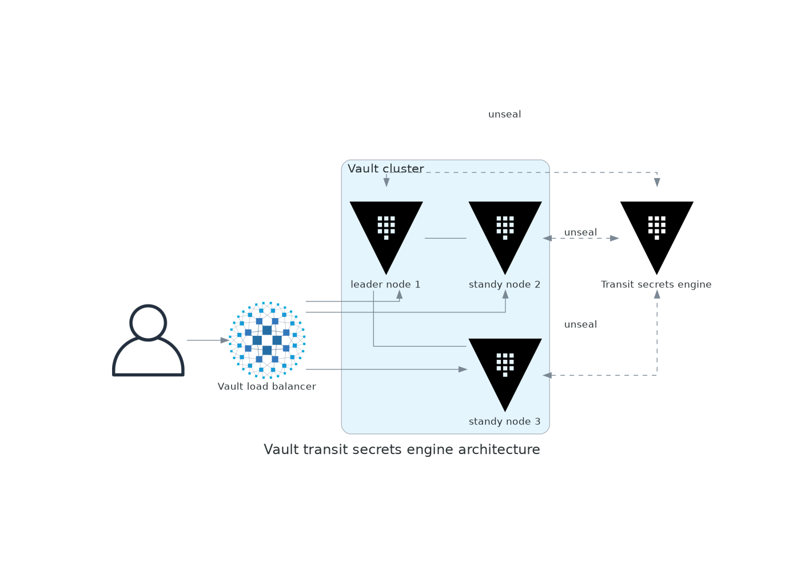

# Vault cluster with auto unseal
Vault cluster leveraging Raft for distributed storage and Transit engine for automated unsealing.

## Architecture

### Components
- **Vault Secrets Cluster**: 3 nodes with Raft storage
- **Vault Transit Secrets Engine**: 1 node for auto-unsealing
- **HAProxy**: Load balancer (http://localhost:8200)

### Features
- Automatic unsealing via Transit engine
- Raft consensus for HA
- Active/standby failover

## Architechure diagram

### Diagram


### Generating diagram
In docker environment from root:
```console
$ uv run diagrams/scripts/vault-transit-raft.py
```

## Reference
- https://developer.hashicorp.com/vault/docs/secrets/transit
- https://developer.hashicorp.com/vault/tutorials/raft/raft-storage
- https://developer.hashicorp.com/vault/docs/internals/integrated-storage
- https://github.com/hashicorp-education/learn-vault-raft/blob/main/raft-ha-storage/new_cluster/cluster.sh
- https://github.com/hashicorp-education/learn-vault-raft/blob/main/raft-storage/local/cluster.sh
- https://developer.hashicorp.com/vault/tutorials/auto-unseal/autounseal-transit
- https://developer.hashicorp.com/vault/tutorials/archive/production-hardening
- https://docs.haproxy.org/3.2/configuration.html
